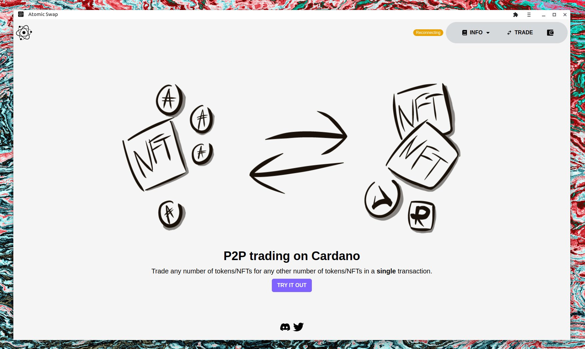

<div align="center">
  <a href="https://atomic-swap.io/">
    
  </a>
  <br />
  <p>
    <h3>
      <b>
        Atomic Swap
      </b>
    </h3>
  </p>
  <p>
    <b>
      Trustless p2p trading on Cardano
    </b>
  </p>
  <p>

[](CODE_OF_CONDUCT.md) [](https://atomic-swap.io/) [](https://twitter.com/intent/tweet?text=Atomic%20Swap%20-%20A%20trustless%20p2p%20trading%20dApp%20on%20Cardano.%20https%3A//atomic-swap.io/%20%23atomicswap%20via%20%40_atomicswap)

  </p>
  <p>
    <sub>
      Built with ❤︎ by
      <a href="https://github.com/honungsburk/atomic-swap/graphs/contributors">
        contributors
      </a>
    </sub>
  </p>
  <br />
  <p>
    <a href="https://atomic-swap.io/" target="_blank">
      
    </a>
  </p>
</div>

## Support

- [Twitter](https://twitter.com/_atomicswap)
- [Discord](https://discord.com/invite/ZqpN4TuJ6a)

## Features

* Trustless trading using multisig transactions
* Create trades with as any number of assets (NFTs, Tokens, and etc)
* P2p networking between clients using webrtc
* Super simple to self-host
* PWA - progressive web app
* Text chat
* Voice chat
* Blacklist/Whitelist assets
* Dark mode

## Getting Up and Running

### Install & Build

1. `npm install --save --legacy-peer-deps react-kawaii `
2. `cd functions`
3. `npm install`
4. Add secrets as explained in "Handling Secrets"
5. `npm run build`
6. `cd ..`
7. `npm run build`

Note: there is currently a bug in chakra-ui that causes builds to fail see this [issue](https://github.com/chakra-ui/chakra-ui/issues/5714).
The best way to resolve it for now is to replace "ColorAdjust" with "PrintColorAdjust" at
"node_modules/@chakra-ui/menu/dist/declarations/src/use-menu.d.ts:480:50" and "node_modules/@chakra-ui/menu/dist/declarations/src/use-menu.d.ts:986:61"

### Serving

After building you can serve the application using by running `firebase emulators:start` and `npm run preview`

### Hot Reloading

When developing you don't need to build the app but can use `firebase emulators:start` and `npm run dev`.
Note that while the frontend is rebuilt automatically the backend must be recompiled before you can serve new versions.

## Storing secrets

Secrets must be stored in a name with the format `secrets.ts` in the `functions/src/` directory.
(This ensures that they are ignored by git.) You get the secrets from [blockfrost](https://blockfrost.io).

Example:

```typescript
export const BLOCKFROST_ID_MAINNET = "...";
export const BLOCKFROST_ID_TESTNET = "...";
```

## **License**

This project is licensed under the [GPL 3.0](https://opensource.org/licenses/GPL-3.0) - see the [`LICENSE`](LICENSE) file for details.

## **Authors**

This project exists thanks to all the people who contribute — [contribute](CONTRIBUTING.md).

* [honungsburk](https://github.com/honungsburk)
